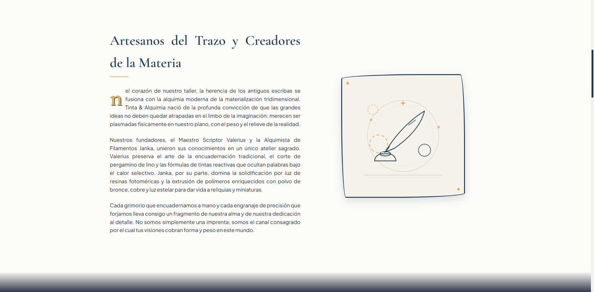
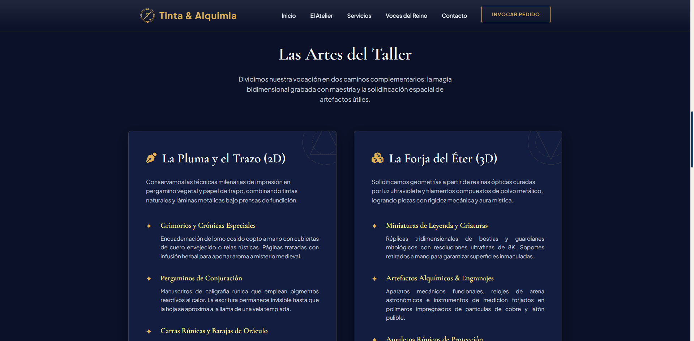
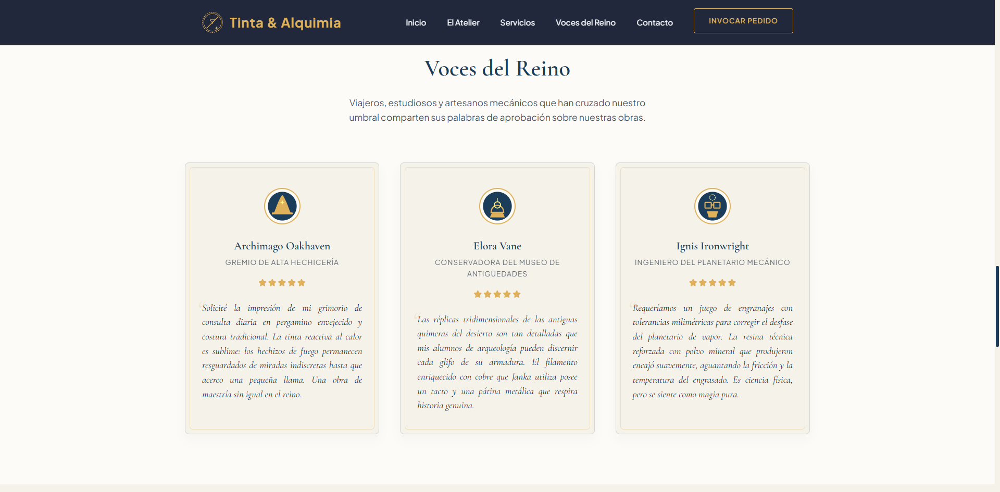
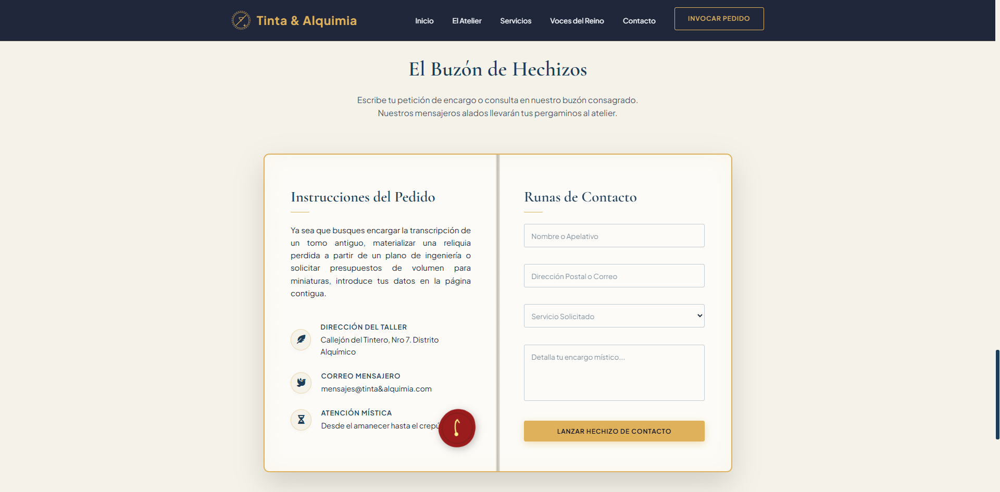
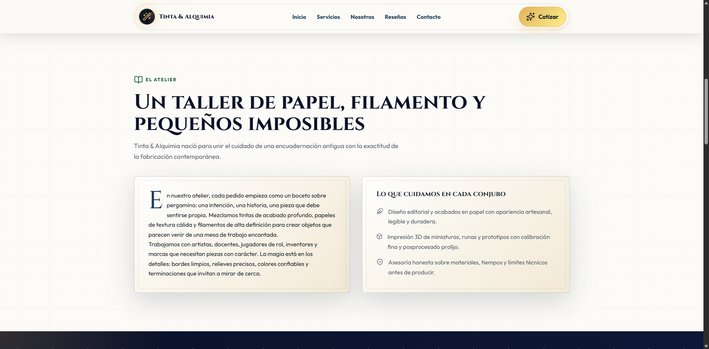
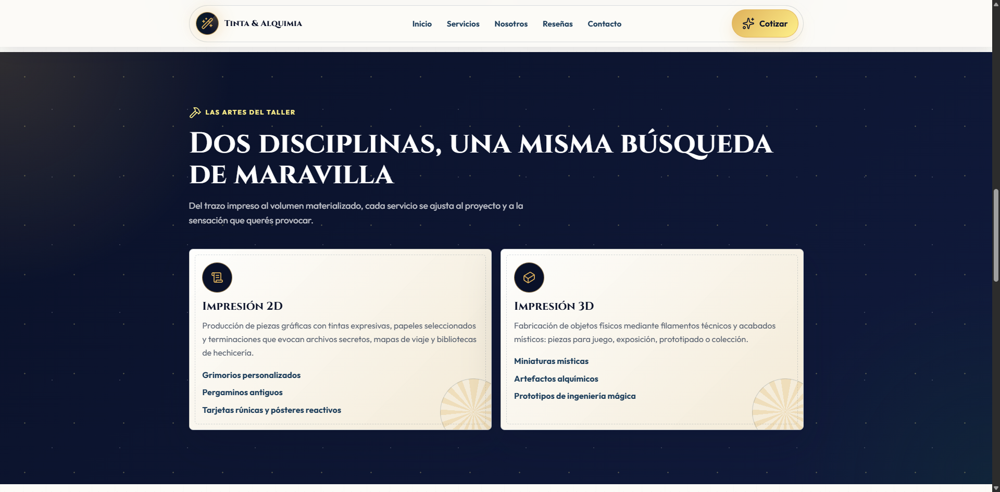
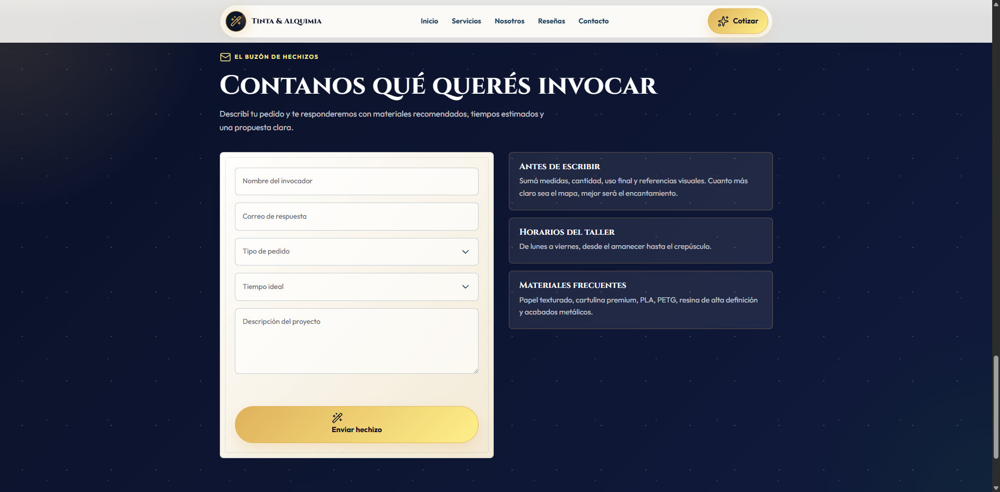

# PFO2 — Prompt Engineering en Agentes de IA

## Tinta & Alquimia · Landing Page (imprenta 2D/3D con estética mágica)

---

## Datos del estudiante

- **Nombre y Apellido:** Adriana Coronel
- **Comisión:** 2° D (lunes)
- **Cátedra:** Desarrollo Frontend
- **Institución:** IFTS N.º 29 — Tecnicatura Superior en Desarrollo de Software

---

## Link al proyecto

🔗 **Portada (Vercel):** [`https://fe-pfo-2-agentes.vercel.app/`](https://fe-pfo-2-agentes.vercel.app/)

> La portada del proyecto contiene el prompt en texto plano y accesos directos a las landings generadas por los agentes.

---

## Objetivo del proyecto

Construir un único prompt de alta precisión y ejecutarlo de forma autónoma en agentes de IA para generar landings visuales y responsivas de una imprenta mágica.

El negocio presentado es **Tinta & Alquimia**, una imprenta artesanal que combina impresión 2D y fabricación 3D con una estética inspirada en *Tongari Boushi no Atelier*: magia cálida, detalles dibujados a mano, pergamino antiguo y acabados dorados.

---

## Prompt utilizado

> El prompt completo se encuentra en [`prompt.txt`](./prompt.txt).

Esta instrucción define:

- un rol claro de desarrollador frontend senior;
- una dirección de arte mágico-artesanal;
- una paleta de colores cálida y elegante;
- tipografías serif para títulos y sans-serif para texto;
- HTML5 semántico, CSS3 con variables y JavaScript nativo;
- interactividad ligera, navegación por secciones y validación básica de formulario;
- las 7 secciones obligatorias: Header, Hero, Sobre Nosotros, Servicios, Testimonios, Contacto y Footer.

<details>

<summary>Haz clic aquí para ver el prompt</summary>

```
  <role>
  Eres un Ingeniero Frontend Principal y Diseñador UI/UX de Élite, especializado en la creación de interfaces web inmersivas, estéticamente deslumbrantes y de nivel premium utilizando únicamente tecnologías web nativas (HTML5, CSS3 Vanilla y JavaScript).
  </role>

  <context>
  Debes diseñar y programar una Landing Page completa, interactiva y totalmente responsiva para un negocio llamado "Tinta & Alquimia".
  "Tinta & Alquimia" es una imprenta mágica que ofrece servicios de:
  1. Impresión 2D: Impresión en papel de grimorios personalizados, pergaminos antiguos, pósteres con tintas reactivas y encuadernaciones mágicas.
  2. Impresión 3D: Creación física mediante filamentos místicos de figuras de criaturas, runas tridimensionales, amuletos personalizados y engranajes alquímicos.

  El diseño web debe inspirarse en la estética visual y artística de "Tongari Boushi no Atelier" (Witch Hat Atelier), transmitiendo una sensación de artesanía hecha a mano, misterio acogedor y maravilla. Los colores deben evocar confianza y alegría.
  </context>

  <design_guidelines>
  - Paleta de Colores:
    * Fondos: Tonos pergamino cálido y suave (#fcfbf7) alternando con secciones en azul noche estrellada (#0a1128) para crear contraste entre el día (estudio/diseño) y la noche (magia/creación).
    * Acentos de Confianza: Azul cobalto profundo (#1c3d5a) y verde esmeralda alquímico (#14532d).
    * Acentos de Alegría y Magia: Oro alquímico brillante (#dfb15b), ámbar cálido (#f59e0b) y luz de estrellas (#fef08a).
  - Tipografía (Importar vía Google Fonts):
    * Títulos: 'Cinzel' o 'Cormorant Garamond' (serif clásica y elegante, evoca textos antiguos y magia).
    * Cuerpo: 'Outfit' o 'Plus Jakarta Sans' (sans-serif moderna, limpia y legible).
  - Elementos Visuales Clave:
    * Círculos Mágicos: Dibujados con SVG o CSS puro (líneas circulares concéntricas, estrellas de 4 u 8 puntas, runas o glifos finos). Deben usarse de forma creativa:
      - Como fondo giratorio lento e interactivo.
      - Como representación de la cama caliente de una impresora 3D (donde se materializan los objetos).
      - Como decoradores interactivos en botones y hover states.
    * Estilo de Trazado: Bordes que parezcan dibujados con pluma estilográfica, esquinas decoradas con motivos astrológicos y texturas que imiten el grano del papel o pergamino.
    * Micro-animaciones: Destellos suaves (glow), rotaciones delicadas de engranajes y círculos mágicos, y transiciones fluidas en todas las interacciones.
  </design_guidelines>

  <required_structure>
  La página debe ser un único archivo `index.html` autónomo que incluya todos los estilos en una etiqueta `<style>` y scripts en `<script>`. Debe estructurarse con HTML5 semántico:

  1. Cabecera (Header):
    - Logotipo de "Tinta & Alquimia" estilizado con un pequeño isotipo de pluma estilográfica cruzada con una boquilla de extrusor 3D (o un círculo mágico).
    - Menú de navegación responsivo con enlaces animados a las secciones principales (Inicio, Servicios, Nosotros, Reseñas, Contacto).
    - Botón CTA secundario con efecto de brillo mágico.

  2. Sección Hero (Sección Principal):
    - Título impactante de corte poético y fantástico (Ej: "Donde la Tinta se Vuelve Realidad y el Hilo Crea Mundos").
    - Subtítulo que explique claramente el negocio (Servicios de impresión artesanal 2D y fabricación mágica 3D).
    - Botón CTA principal ("Invocar un Pedido") con una animación de destello o borde mágico, y un botón secundario ("Explorar el Atelier").
    - Un elemento visual central interactivo: Un círculo mágico animado en 3D que simula "imprimir" o materializar un objeto al pasar el cursor (hover).

  3. Descripción / Sobre Nosotros (El Atelier):
    - Una narrativa en tonos de fantasía pero profesional, explicando el origen del taller, la fusión de tintas mágicas tradicionales y la alquimia de filamentos para impresión 3D.
    - Diseño a dos columnas con detalles de texturas de pergamino y tipografía cuidada con capitulares elegantes.

  4. Sección de Servicios / Características (Las Artes del Taller):
    - Presentación de servicios dividida claramente en dos disciplinas:
      * Impresión 2D (Grimorios, Pergaminos, Tarjetas Rúnicas).
      * Impresión 3D (Miniaturas Místicas, Artefactos Alquímicos, Prototipos de Ingeniería Mágica).
    - Tarjetas interactivas con efectos hover de elevación, iluminación del borde (glow) y pequeños círculos mágicos que rotan cuando el cursor pasa por encima.

  5. Testimonios / Reseñas (Voces del Reino):
    - Una cuadrícula o carrusel de opiniones de clientes (magos, artesanos, inventores) con fotos ficticias o avatares vectoriales de siluetas mágicas.
    - Diseños en tarjetas con estilo de carta de tarot o pergamino flotante, con sistema de calificación por estrellas doradas.

  6. Formulario de Contacto (El Buzón de Hechizos):
    - Formulario maquetado visualmente de manera espectacular (estilo libro de hechizos abierto o carta lacrada).
    - Campos de entrada con etiquetas flotantes animadas y bordes de círculos mágicos.
    - Validación interactiva nativa mediante HTML5 y JavaScript.
    - Envío de formulario controlado por JS: Al enviar, debe bloquear los inputs, mostrar una animación de "conjuración de mensaje" (círculo de carga mágico) y abrir un modal/popup de éxito que diga: "¡Hechizo de Contacto Enviado con Éxito! Nuestros mensaguers alados responderán pronto."

  7. Pie de página (Footer):
    - Redes sociales con iconos de FontAwesome/Lucide enlazados, que brillan al pasar el cursor.
    - Horarios del taller ("De lunes a viernes, desde el amanecer hasta el crepúsculo").
    - Enlaces de políticas y derechos de autor.
  </required_structure>

  <technical_constraints>
  - Solo HTML, CSS y JavaScript nativo en un único archivo.
  - Responsividad impecable (Mobile-First o totalmente adaptativo con media queries).
  - Prohibido el uso de TailwindCSS o frameworks JS/CSS.
  - Cero texto de relleno (Lorem Ipsum). Todo el contenido debe estar en español y estar completamente redactado con textos inmersivos y profesionales del negocio.
  - Los iconos y fuentes deben cargarse mediante CDN estándar y confiable (Google Fonts, Lucide Icons o FontAwesome).
  - La interactividad debe implementarse con transiciones fluidas de CSS y JavaScript eficiente.
  </technical_constraints>

  <output_instructions>
  Por favor, responde de la siguiente manera:
  1. Comienza con una sección `<design_thinking>` donde expliques detalladamente tu concepto de diseño, la paleta exacta de colores (hex/hsl), la tipografía elegida y cómo implementaste la estética de *Tongari Boushi no Atelier*.
  2. A continuación, escribe todo el código HTML/CSS/JS de la Landing Page dentro de un único bloque de código marcado con la etiqueta `<code_output>`. Asegúrate de que el código sea de producción, limpio, bien estructurado y listo para usar sin requerir ninguna modificación.
  </output_instructions>

```

</details>

---

## Agentes y landings generadas

Las landings están disponibles en estas carpetas:

- [`agent1/index.html`](./agent1/index.html)
- [`agent2/index.html`](./agent2/index.html)

> Cada carpeta contiene una landing generada de forma autónoma por un agente.

---

## Estructura del repositorio

```
FE-PFO2-Agentes/
├── index.html          # Portada del proyecto y acceso a las landings
├── prompt.txt          # Prompt exacto utilizado para generar las landings
├── README.md
├── agent1/
│   └── index.html
└── agent2/
    └── index.html
```

---

## Capturas de pantalla

### Agente 1 — Antigravity (Gemini 3.5 Flash)

> 

> 

> 

> 

> 

### Agente 2 — Codex (GPT-5.5-Codex)

> 

> 

> 

> 

> 

---

## Restricción metodológica cumplida

✅ El código generado por cada agente **no fue modificado manualmente**. Cada agente trabajó de forma autónoma sobre la base del mismo prompt, dentro de su respectiva carpeta (`/agente-1` y `/agente-2`), priorizando el diseño del prompt inicial sobre la iteración manual posterior.
