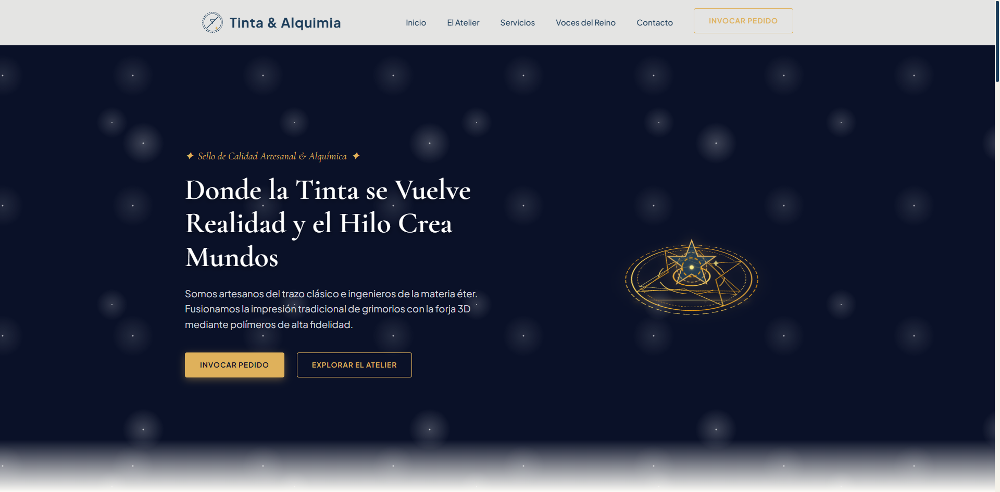

# PFO2 — Prompt Engineering en Agentes de IA

## Tinta & Alquimia · Landing Page (imprenta 2D/3D con estética mágica)

---

## Datos del estudiante

- **Nombre y Apellido:** Adriana Coronel
- **Comisión:** D (lunes)
- **Cátedra:** Desarrollo Frontend
- **Institución:** IFTS N.º 29 — Tecnicatura Superior en Desarrollo de Software

---

## Link al proyecto

🔗 **Portada (Vercel):** `https://___tu-proyecto___.vercel.app/`

> La portada del proyecto contiene el prompt en texto plano y accesos directos a las landings generadas por los agentes.

---

## Objetivo del proyecto

Construir un único prompt de alta precisión y ejecutarlo de forma autónoma en agentes de IA para generar landings visuales y responsivas de una imprenta mágica.

El negocio presentado es **Tinta & Alquimia**, una imprenta artesanal que combina impresión 2D y fabricación 3D con una estética inspirada en *Tongari Boushi no Atelier*: magia cálida, detalles dibujados a mano, pergamino antiguo y acabados dorados.

---

## Prompt utilizado

> El prompt completo se encuentra en [`prompt.txt`](./prompt.txt).

Esta instrucción define:

- un rol claro de desarrollador frontend senior;
- una dirección de arte mágico-artesanal;
- una paleta de colores cálida y elegante;
- tipografías serif para títulos y sans-serif para texto;
- HTML5 semántico, CSS3 con variables y JavaScript nativo;
- interactividad ligera, navegación por secciones y validación básica de formulario;
- las 7 secciones obligatorias: Header, Hero, Sobre Nosotros, Servicios, Testimonios, Contacto y Footer.

---

## Agentes y landings generadas

Las landings están disponibles en estas carpetas:

- [`agent1/index.html`](./agent1/index.html)
- [`agent2/index.html`](./agent2/index.html)
- [`agent3/index.html`](./agent3/index.html)
- [`agent4/index.html`](./agent4/index.html)

> Cada carpeta contiene una landing generada de forma autónoma por un agente.

---

## Estructura del repositorio

```
FE-PFO2-Agentes/
├── index.html          # Portada del proyecto y acceso a las landings
├── prompt.txt          # Prompt exacto utilizado para generar las landings
├── README.md
├── agent1/
│   └── index.html
├── agent2/
│   └── index.html
├── agent3/
│   └── index.html
└── agent4/
    └── index.html
```

---

## Capturas de pantalla

### Agente 1 — Claude Code (Claude Sonnet 4.6)

> _(Insertar capturas en `screenshots/` y referenciarlas acá, ej:)_
>
> 

### Agente 2 — Codex (GPT-5.1-Codex)

> _(Insertar capturas en `screenshots/` y referenciarlas acá, ej:)_
>
> 

---

## Restricción metodológica cumplida

✅ El código generado por cada agente **no fue modificado manualmente**. Cada agente trabajó de forma autónoma sobre la base del mismo prompt, dentro de su respectiva carpeta (`/agente-1` y `/agente-2`), priorizando el diseño del prompt inicial sobre la iteración manual posterior.
